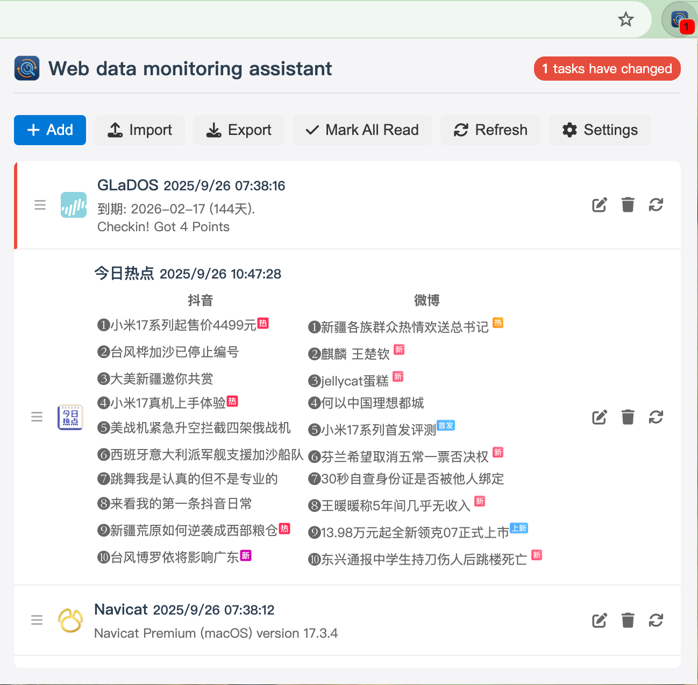

# Web Data Monitoring Assistant

Web Data Monitoring Assistant is a Chrome extension that allows you to monitor changes in web page data and receive notifications when changes occur.

[中文版本](README_zh.md)

## Screenshots

*Screenshots of the extension in action*

*Task editor with code editor and configuration options*

## Features

- Monitor any web page data with customizable intervals (minutes or hours)
- Custom JavaScript code to extract and process data from web pages
- Popup notifications when monitored data changes
- Support for various HTTP request methods (GET, POST, PUT, DELETE, PATCH)
- Support for custom request headers and body
- Multiple data type support (JSON, Text, HTML, XML)
- Task management with enable/disable options
- Export/import task configurations
- Multi-language support (English, Simplified Chinese, Traditional Chinese)
- Task execution history tracking

## Installation

### From Chrome Web Store (Coming soon)

The extension will be available on the Chrome Web Store soon.

### Manual Installation

1. Clone or download this repository
2. Open Chrome and navigate to `chrome://extensions`
3. Enable "Developer mode" in the top right corner
4. Click "Load unpacked" and select the extension directory

## Usage

1. Click on the extension icon in the Chrome toolbar to open the popup
2. Click "Add Task" to create a new monitoring task
3. Configure the task:
   - Set task title and URL
   - Configure monitoring frequency
   - Set request method, headers, and body if needed
   - Write JavaScript code to extract and process data from the response
4. Save the task and enable it
5. The extension will monitor the specified URL at the configured interval
6. When data changes, you'll receive a popup notification

## License

This project is licensed under the MIT License - see the [LICENSE](LICENSE) file for details.