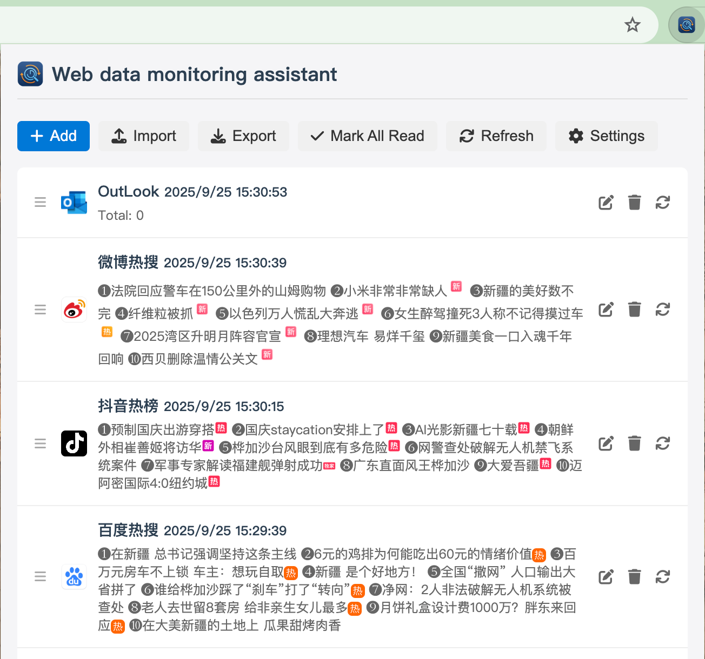

# 网页数据监控助手

网页数据监控助手是一款 Chrome 扩展程序，可以让你监控网页数据的变化，并在发生变化时收到通知。

[English Version](README.md)

## 截图

*扩展程序运行截图*

*任务编辑器界面，包含代码编辑器和配置选项*

## 功能特性

- 监控任意网页数据，支持自定义间隔（分钟或小时）
- 使用自定义 JavaScript 代码从网页中提取和处理数据
- 数据变化时弹出通知
- 支持多种 HTTP 请求方法（GET、POST、PUT、DELETE、PATCH）
- 支持自定义请求头和请求体
- 多种数据类型支持（JSON、Text、HTML、XML）
- 任务管理，支持启用/禁用任务
- 导出/导入任务配置
- 多语言支持（英语、简体中文、繁体中文）
- 任务执行历史记录跟踪

## 安装

### 从 Chrome 网上应用店安装（即将推出）

该扩展程序即将在 Chrome 网上应用店上线。

### 手动安装

1. 克隆或下载此仓库
2. 打开 Chrome 并访问 `chrome://extensions`
3. 在右上角启用"开发者模式"
4. 点击"加载已解压的扩展程序"，然后选择扩展程序目录

## 使用说明

1. 点击 Chrome 工具栏中的扩展程序图标打开弹出窗口
2. 点击"添加任务"创建新的监控任务
3. 配置任务：
   - 设置任务标题和URL
   - 配置监控频率
   - 如需要，设置请求方法、请求头和请求体
   - 编写 JavaScript 代码从响应中提取和处理数据
4. 保存任务并启用
5. 扩展程序将按配置的间隔监控指定的URL
6. 当数据发生变化时，您将收到弹出通知

## 许可证

该项目采用 MIT 许可证 - 详见 [LICENSE](LICENSE) 文件。
